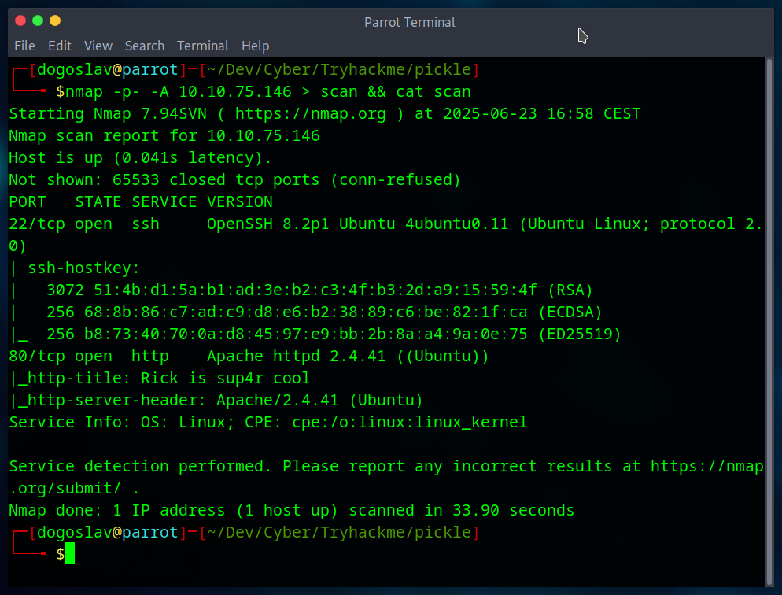
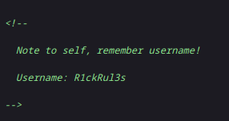
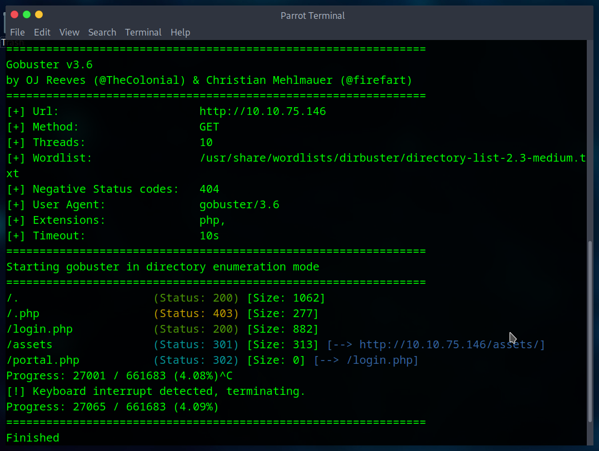
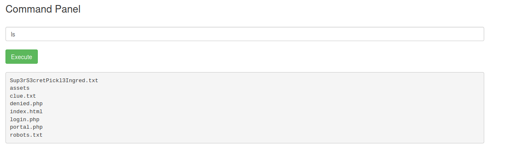
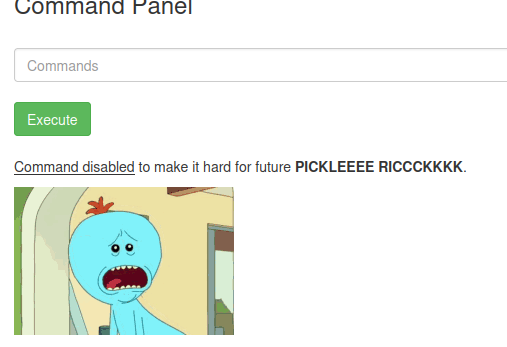
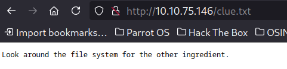
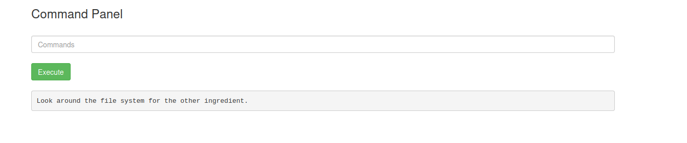
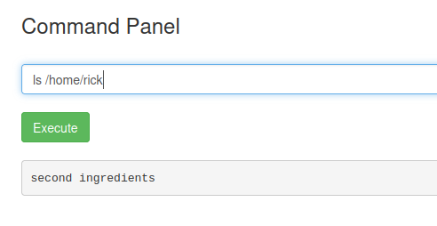
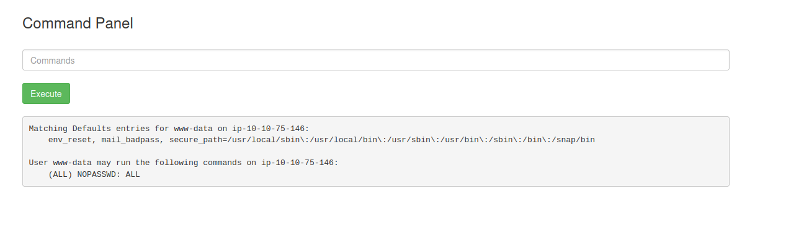
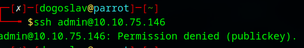

# Pickle Rick

<pre>This Rick and Morty-themed challenge requires you to exploit a web server and find three ingredients to help Rick make his potion and transform himself back into a human from a pickle.</pre>

We are asked to exploit a page and find 3 ingredients (flags).

Starting with a nmap scan for every port

Nothing unusual we can see ssh and http port open.

Let's explore the website. Site has not any links, its basic static website.

However we can see node left in the website source code. It can be usefull later.

In http://site/robots.txt file can be found `Wubbalubbadubdub`.

Let's continue in enumeration and go for hidden directories with gobuster.

There are 2 interesting directories `/login.php` and `/portal.php`. But the `/portal.php` just redirects user to `/login.php`.

It's a basic login page, let's try to bruteforce password using `R1ckRul3s` username.

After some time brute force failed.

The password for `R1ckRul3s` was `Wubbalubbadubdub`

Now user has acces to Command Panel 

There is our first flag `Sup3rS3cretPickl3Ingred.txt`. However the `cat` command is disabled.

But the `Sup3rS3cretPickl3Ingred.txt` is in the /var/www/html/ directory so we can acces it just by paste it as a directory and get the **first flag**.

As the flag we can open the `clue.txt` file. 

We can't use `cat`, so it's hard to read a file. Lets try alternative to `cat` like `less` command.

**It worked!**

Now we can look for the second ingredient as the `clue.txt` file said.

It's located in `/home/rick` repository.

We can now use `less` command to get the **second flag**.

After while I tried `sudo -l` command to see if i can run anythink with privilages. It turned out that I have sudo on every command.

The ssh protocol of the machine supports only key login.

After searching we can find the third flag in root's directory.

